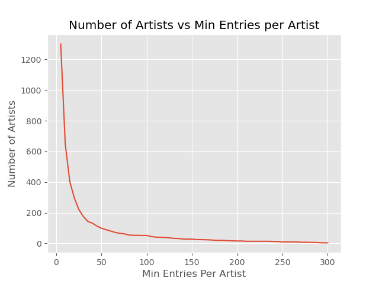
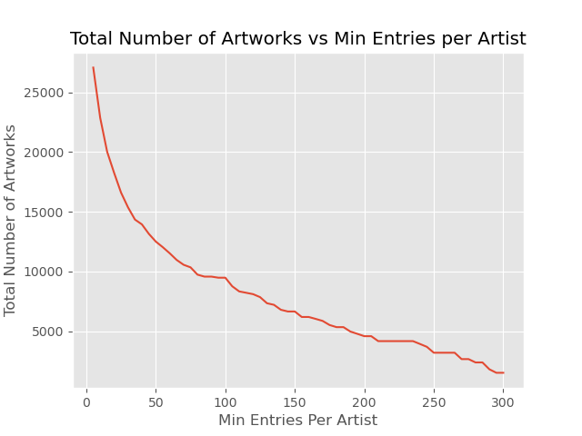
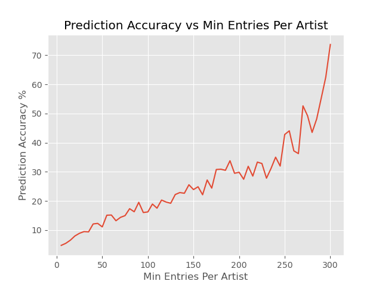
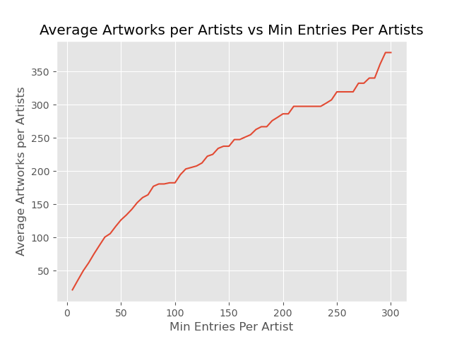
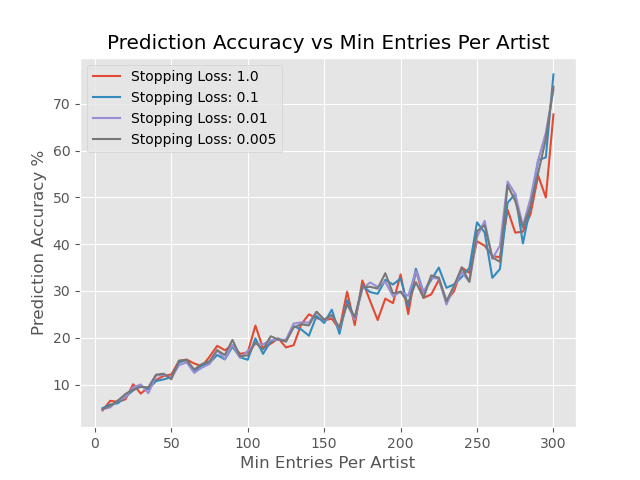
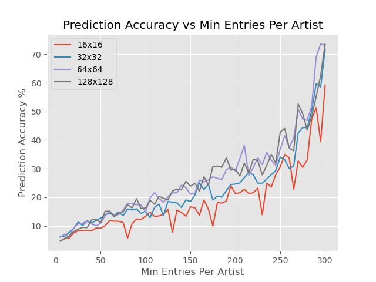
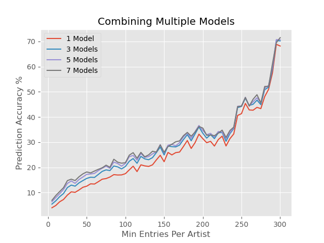

<!-- TABLE OF CONTENTS -->

  
Table of Contents

  <ol>
    <li><a href="#usage">About This Project</a></li>
    <li><a href="#roadmap">Task</a></li>
    <li><a href="#contributing">Data Collection and Selection</a></li>
    <li><a href="#license">Initial Tests and Results</a></li>
    <li><a href="#contact">Test 1: Stopping Loss</a></li>
    <li><a href="#acknowledgements">Test 2: Image Resolutions</a></li>
    <li><a href="#acknowledgements">Test 3: Multiple Models</a></li>
  </ol>

<!-- ABOUT THIS PROJECT -->
## About This Project

This was a school project for my CS 472 Machine Learning class at BYU. The goal of the project was to get the highest possible generalization accuracy on a real world application. I had to come up with some task which could be generalized using machine learning and go through all the steps from beginning to end to get a good result. I worked on this project over the course of about a week and a half in December of 2020. I spent approximately 50-100 hours gathering data, testing, and iteratively improving my results.

<!-- TASK -->
## Task

The task I chose was to predict the artist of a particular work of art. All works of art used for this project were sourced from the [Web Gallery of Art](https://www.wga.hu/), a searchable database of European fine arts and architecture (3rd-19th centuries), currently containing over 50,500 reproductions. Below is a table containing a few selected entries from the `catalog.csv` file, which contains entries for every work of art in WGA's database at the time of downloading.

|AUTHOR|BORN-DIED|TITLE|DATE|TECHNIQUE|LOCATION|URL|FORM|TYPE|SCHOOL|TIMEFRAME|
|:----:|:----:|:----:|:----:|:----:|:----:|:----:|:----:|:----:|:----:|:----:|
|"AACHEN, Hans von"|"(b. 1552, K�ln, d. 1615, Praha)"|Venus and Adonis|1574-88|"Oil on canvas, 68 x 95 cm"|"Fogg Art Museum, Harvard University, Cambridge"|https://www.wga.hu/html/a/aachen/adonis.html|painting|mythological|German|1601-1650|
|MICHELOZZO DI BARTOLOMEO|"(b. 1396, Firenze, d. 1472, Firenze)"|Funeral Monument of Cardinal Rainaldo Brancacci|c. 1427|"Marble, partly gilded and polychrome, 1160 x 460 cm"|"Sant'Angelo a Nilo, Naples"|https://www.wga.hu/html/m/micheloz/2/brancacc.html|sculpture|religious|Italian|1401-1450|
|"ZWIRNER, Ernst Friedrich"|"(b. 1802, Jakobswalde, d. 1861, K�ln)"|Exterior view|1839-43|Photo|"St. Apollinaris, Remagen"|https://www.wga.hu/html/z/zwirner/remagen.html|architecture|other|German|1801-1850|

<!-- DATA -->
## Data Collection and Selection

In order to download each work of art, I created the `download_catalog.py` script to read through each entry in `catalog.csv` and send a request to the entry's URL. Once downloaded and saved, the script then resizes each image to the specified dimensions (initially I used 128x128). 

I also excluded any entries that were not "paintings" since "sculptures" or "architectures" were photographs of the work of art and contained unrelated noise in the background. In total there were 31,746 paintings downloaded over a 7 to 8 hour time period, occupying 135 Mb of space.

<!-- INITIAL -->
## Initial Tests and Results

The model I used for this project comes from [PyTorch's Training a Classifier tutorial](https://pytorch.org/tutorials/beginner/blitz/cifar10_tutorial.html). It is a basic Convolutional Neural Network (CNN) that takes an 3xNxN Tensor input - where N is the dimension of the image - and outputs a 1xM probability Tensor - where M is the number of unique authors in the catalog (restricted to only paintings).

I trained the CNN on 10% of the downloaded images and after about 3 minutes and 60 epochs, the average loss for all paintings was < 0.01 using cross-entropy loss as my metric. I set my "stopping loss" at 0.01 and my "maximum epochs" to 100, then trained on 100% of the data until either the average loss for the last epoch was less than the "stopping loss" or the "maximum epochs" was reached. Once I verified that the CNN was able to reach the "stopping loss" before 100 epochs, I moved on to splitting the paintings into train/test data sets.

There was one major restriction I had to work around when splitting the paintings into training and test sets. That was that the set of authors of paintings in the test set - test authors - had to be a subset of the authors of paintings in the training set - training authors. If there were paintings with authors in the test authors set that were not also in the training authors set, then the model would never be able to correctly guess the authors of those paintings.

My procedure for splitting the paintings into training and test sets involved repeatedly shuffling all paintings, sending 90% of paintings to the training set and 10% to the test set, then checking if the restriction mentioned above was satisfied. Since there are many authors that only have a single painting in the catalog, it is likely that one of those single-work artists would end up in the test authors set and violating the restriction. Thus, in order to reduce the number shuffle/split repetitions, I reduced the total number of artworks to exclude works by artists with fewer than 5 works to them. Again I trained until either "stopping loss" or "max epochs" was reached, then I measured the accuracy of the model by having it predict the artist for every painting in the test set and dividing the number of correct guesses by the size of the test set. With the minimum number of artists per artwork at 5, my model attained predictive accuracy of 4%.

4% was a decent accuracy considering there were 1300 classes and over 25,000 paintings, but I wanted to see if I could increase the predictive accuracy even more by raising the minimum works of art per artists. However, this would also reduce the total number artworks. The 2 graphs below show the relationship between artists/artworks and the minimum artworks per artists.

I repeated the test performed above 60 times, starting with 5 minimum works and increasing by 5 until 300. My theory was proven correct, and I was able to reach an accuracy above 70% with 300 minimum works. This is because the ratio of artworks to artists increases with the minimum works per artist. At 5 minimum works per artists, there are - on average - about 21 works per artist and at 300 minimum works per artists, there are an average of 379 works per artists. 

<!-- Test1 -->
## Test 1: Stopping Loss

After my initial results, I theorized that perhaps using a stopping loss of 0.01 was leading to my model over-fitting the training images and lowering the prediction accuracy as a result. So I lowered the stopping accuracy to 0.005, and recorded the accuracy at when the average loss of the last epoch was 1.0, 0.1, 0.01, and 0.005. What I found is that all 4 stopping losses were roughly equivalent in accuracy, and over-fitting was likely not a problem. The results of this test are displayed below.

For future tests I used a stopping loss of 0.01.

<!-- Test2 -->
## Test 2: Image Resolutions

Next I wanted to see if different image resolutions would affect the accuracy of the model. I re-downloaded all of the images from the catalog at 16x16, 32x32, 64x64, and 256x256 resolutions. 256x256 proved to be too large of a resolution, and was causing my GPU driver to run out of memory, so I wasn't able to graph the accuracies for this resolution. For all the others, the results are displayed below.

The results show that 16x16 and 32x32 resolutions performed noticeably worse than 64x64 and 128x128. However upon closer examination, when the model was training on 16x16 and 32x32 resolutions, it always trained until the maximum epoch of 100 was reach instead of the stopping loss. This indicated that had the models been allowed to train for more epochs until the stopping loss was reached, 16x16 and 32x32 resolution would have had similar accuracies to 64x64 and 128x128.

<!-- Test3 -->
## Test 3: Multiple Models

For my final test before this project was due, I wanted to implement an ensemble technique called bootstrap aggregating or bagging. This technique combines several identical models, each trained on a slightly different training set, and combines their predictions together to create a new (often times superior) prediction. For all 60 minimum works values, I created 7 models. I split my data into 90% training and 10% test sets. Then each of the 7 models was trained on a random 90% of the training set, or 81% of all the paintings. Once all 7 models had been trained, I evaluated the accuracy using combinations of 1, 3, 5 and 7 # of models. For each # of models being evaluated, I iterated through all possible combinations of that # of models, predicting with each model, summing the predictions together, and assessing the accuracy for that combination. I then averaged all accuracies for every combination to get the final accuracy for that # of models. The results of this test are shown below.

In total, this test took about 42.5 hours to complete. I was pleased to see that bagging had increased accuracies across the board, if only by a little. Though with high minimum works per artist, the difference between 3, 5, and 7 models was barely noticeable.